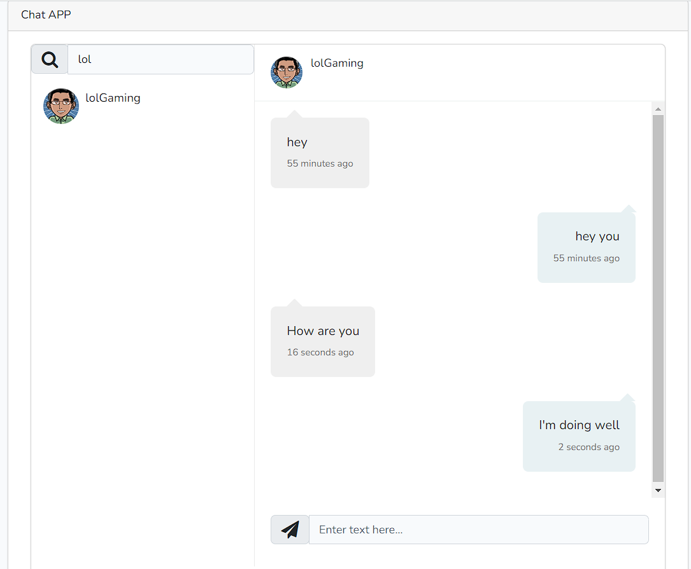

### Chat App
## TO Run The Project 
> composer install

> npm install && npm run dev

> Connect to your database

> php artisan migrate

> php artisan serve



## Code Preview

We are making a simple query to get all Messages (Sent and Received),
While using **with('user')** to get Relationship between them.
We are if condition to make sure there are a chat selected.
```
public function mount()
{
    if ($this->activeUserChat)
    {
        $this->allMessages  = Message::with('user')
        ->where(function($query){
            $query->where('from_user_id',auth()->user()->id)
            ->where('to_user_id',$this->activeUserChat->id);

        })->orWhere(function($query){
            $query->where('to_user_id',auth()->user()->id)
            ->where('from_user_id',$this->activeUserChat->id);
        })->get();
    }
}
```

And here we get **$this->activeUserChat**, Then we remount the component. 
```
public function getMessage($id)
{
    $this->activeUserChat = User::where('id', $id)->first();
    $this->mount();
}
```

We are looping over **allMessages** Then we know if those messages are sent or reviced 
```
@if ($message->user->id == auth()->user()->id)
```

>I used `<div wire:poll.1000ms></div>` To refresh component every second to get any message we Receive but it seems it worked with only the message >Time(sent from), But on changing chat or sending a new message the component will live refresh to get recent messages

